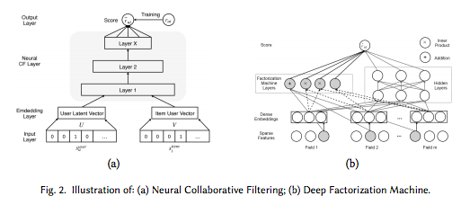

# Comentario: "Deep Learning based Recommender System: A Survey and New Perspectives"
## Resumen
En este artículo se busca entregar una clasificación de sistemas recomendadores basados en deep learning, junto a un resumen de lo más actual del área.

En la introducción comienzan explicando la importancia de los sistemas recomendadores dentro de la infinidad de información que hay en internet y del gran *hype* que ha tenido Deep Learning en los últimos años, y que juntos han tenido un éxito increíble dentro del área de la investigación como en el área de las industrias.

Luego nos introducen la terminología básica y los conceptos más importantes en los sistemas recomendadores y en el área de Deep Learning. 

En la parte de sistemas recomendadores nos explican que hay 3 categorías: *Collaborative Filtering*, *Content Based* e *Hybrid*. Los tres ya los vimos en papers anteriores.

Para el artículo toman en cuenta cualquier arquitectura neuronal que se busque optimizar la función de pérdida con SGD como una arquitectura de Deep Learning. En el documento nos presentan los ocho más conocidos en los que se encuentra: MLP, CNN y RNN.

Después nos cuentan las principales fortalezas de los sistemas recomendadores basados en deep learning:

1. Los *Deep neural networks* son capaces de modelar la no-linealidad que hay dentro de los datos, dandonos la posibilidad de capturar patrones complejos en la relación *user-item*.
2. Estas redes son capaces de recomendar contenido con información muy heterogenea como: texto, imágenes, audios y videos.
3. Este tipo de recomendadores muestran resultados bastante prometedores en cumplir tareas de modelación secuencial como chatbots, reconocimiento de discursos, entender el lenguaje natural, etc.
4. Las técnicas de Deep Learning son muy flexibles y hay varios *frameworks* que ayudan a trabajar con ellos.

Pero también estos recomendadores tiene limitaciones especialmente en la interpretabiidad de la recomendación, el requerimiento de muchísima data y el extenso calibramiento de hiperparámetros.

Luego entra en lleno a lo que son los recomendadores mismos. Nos cuentan que hay dos tipos de recomendador: con *Neural Building Blocks* y *Deep Hybrid Models*. Después nos presentan los algoritmos basados en MLP, y el que me llamó más la atención fue *Wide & Deep Learning* ya que mezclaba un sistema lineal con uno no-lineal sacando la mejor parte de cada uno.

Posteriormente le tocó el turno a los recomendadores basados en Autoencoder para terminar la lectura con los recomendadores basados en CNN.

## Opinión
Me ha gustado muchísimo este artículo. Lo he encontrado muy completo y muy bien hecho. Personalmente no sabía nada de Deep Learning y, sin embargo, siento que entendí bastante bien el texto.

Me gustó mucho que explicaran todo desde cero, para las personas que no sabemos nada del tema, nos es muy útil todas las explicaciones de la terminología y de los conceptos básicos.

Me gustaron también la imágenes que colocaban. Ayudaban mucho a imaginarse lo que estaban explicando y ayudaba a que el lector no se sintiera tan perdido.

También destaco que mostraron las limitaciones de los sistemas recomendadores basados en deep learning. Esto nos da una perspectiva más real de lo que estamos leyendo y no creemos que es un solucionador de todo tipo de situaciones.

Me encantó que tuviera muchísimas referencias y que en cada punto del artículo nos dan algún paper para profundizar mejor el tema. Creo que lo hace un buen documento para empezar a aprender del tema y uno podría sacar muchísima más información de las referencias.

Para ir cerrando, este texto lo disfruté mucho leyéndolo. Sentí que aprendí mucho de deep learning, especialmente en sistemas recomendadores. Obviamente no siento que soy un experto en deep learning, pero si me motivó mucho a aprender más.