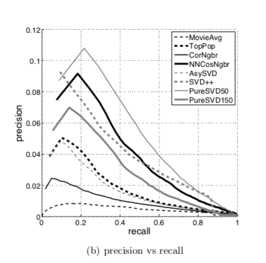

# Crítica: Performance of Recommender Algorithms on Top-N Recommendation Tasks
En este paper se pone en duda la forma que se han evaluado los sistemas recomendadores que recomiendan una lista de N items. En el documento comienza comentando que hasta ahora las metricas de evaluación más comunes han sido las métricas de error tales como RSME y MAE, pero que estas realmente no miden el rendimiento de un Top-N. Aseguran que el error no tiene una relación con el *accurracy*, y es por eso que proponen usar metricas basadas en el *accuracy* tales como *Recall* y *Precision*.

Luego explican cómo va a funcionar el metodología del testeo. A grandes razgos lo que hacen para evaluar las recomendaciones con *Recall* y *Precision*, es que a cada item que se le predijo 5 estrellas en el set de test se le hace un proceso para ver si es un acierto o una equivocación. Este proceso vendría siendo juntar el *item* al que se le predijo su *rating* junta a otros 1000 *items* aleatorios, para luego ordenarlos según sus predicciones. Ahora si el item que se le está aplicando este proceso está dentro de los N mejores, entonces es un acierto. En caso contrario, es un *miss*.

Otro punto importante de la metodología es la decisión de eliminar el 2% de items más populares del set de test, que generalmente son excesivamente más pupolares que los que lo siguen.

Justo antes de los resultados, hacen una leve explicación de los algoritmos que se van a usar para hacer la comparación entre las métricas de error y las métricas de *accurracy*. Coinciden bastante con los que hemos visto en el curso.

Finalmente para los resultados queda bastante claro que el orden de los algoritmos con respecto a las métricas de error y el orden con respecto a las de *accurracy* son bien distintas. De hecho llega al punto en que algoritmos que con metricas de error eran bastante buenos, con las métricas de *accurracy* superan por poco a algoritmos no personalizados como *Top Popular*, demostrando así que no hay una relación entre el error y el *accurracy*.

Este paper me gustó mucho porque siento que cambia algo escencial en la investigación de los Sistemas Recomendadores y que propbablemente haya traido un gran cambio en el área.

Es muy curioso como dudan de una de las bases: cómo se evaluan los sistemas recomendadores. Al menos a mí me sucedió que leyendo los otros papers, nunca dudé en el sistema en el que se comprueba si el algoritmo es bueno o malo. Simplemente asumí que así se hacía. En cambio Cremonesi, Koren y Turrin ponen en jaque las métricas de evaluación que se estaban usando, dandose cuenta que no lo estaban haciendo bien y proponiendo una solución.

Me gustó mucho, que a diferencia de las lecturas de las otras semanas, usaron más de un dataset logrando afirmar un poco lo que quería comunicar. Al usar muchos algoritmos también refuerzan lo anterior.

Como la mayoría de las lecturas que hemos leído, me gusta mucho el orden en el que se explica el paper. Se ve todo ordenado y ayuda a entender de mejor forma lo que quieren comunicar. Los gráficos también estaban muy buenos, muy completos y explicativos.

Para ir cerrando, me gustó mucho este paper. Fue conciso y explicativo. Además considero que su contenido es muy importante y supongo que fue un gran aporte a la investigación de los Sistemas Recomendadores ya que critíca una de las bases del área y no asume que las cosas que se estaban haciendo son necesariamente correctas. Creo que este paper cambió por completo la forma en el que se alguien puede diferenciar entre un buen algoritmo de uno no tan bueno.