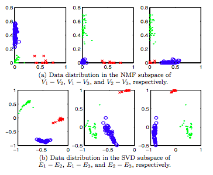
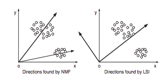

# Comentario: Contets-Based Recommendation Systems
## Resumen
En este paper se presentó un método de *clustering* de tipo *partitional* basado en NMF, que arroja resultados bastantes mejores a los que habían basados en SVD y vectores propios.

Este método se destaca ante LSI principalmente por 3 razones:
1. No es necesario tener vectores latentes que son ortogonales.
2. Los documentos son una combinación de los vectores latentes por lo que tienen más sentido en el dominio de los textos.
3. Cada cluster se puede identificar con el NMF.

Luego por medio de NMF logran sacar de *term-document matrix* X calculan las matrices U y V, donde V es la que determina el *cluster label*.

Para terminar hacen dos experimentos para demostrar que efectivamente el algoritmo es mejor a los anteriormente mensionados.

El primer experimento consiste en mostrar gráficamente cómo quedan los ejes con respecto a los clusters y compararlo con los de SVD. Los resultados fueron:

El segundo consiste en ver el *accuracy* del algoritmo con respecto a dos datasets que probaron. Donde resultó que destacó más con el dataset de TDT2 que el de Reuters dado a que los clusters eran más compatos y *focused*.

## Opinión

A pesar de que era un texto corto, no lo encontré sencillo de leer. Puede que haya sido por haber sabido poco del manejo de clusters. A pesar de eso, quedé con la idea de que es un paper que mejoró mucho el rendimiento del área de los clusters.

Las imágenes me ayudaron mucho a entender lo que estaba leyendo, las encontré muy claras y auto-explicativas. Especialmente la que puse más arriba y otra que también visualizaba los ejes y los clusters.

Ambas imágenes me fueron muy útiles para aterrizar todo el contenido que estaba leyendo.

Me habría gustado que se hubiera explayado un poco más en la introducción y en los trabajos anteriores, para entender un poco mejor el contexto y las comparaciones que se hicieron en el texto.

Para ir cerrando, creo que fue un paper bastante potente y que cambió un poco el pensamiento de cómo deben ser los vectores latentes. Lo que me hace pensar que quizás este conocimiento se pueda aplicar en otros sistemas recomendadores que no necesariamente tienen que ver con clusters. También quiero mensionar que a pesar de que perdí un poco con los valores de las metricas de evaluación, quedó bastante claro lo bueno que era su algoritmo y por qué era mejor a los otros.