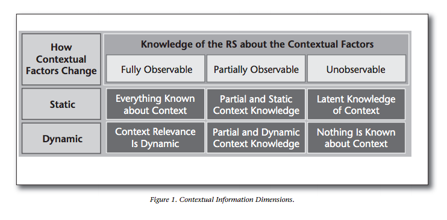

# Comentarios: Context-Aware Recommender Systems
## Resumen
Este es el primer paper que leemos en este curso que incorpora el contexto dentro de la recomendación. Y convenientemente comienza con una buena introducción.

La introducción comienza con el significado de "contexto" y lo amplio que puede llegar a ser. Luego nos introduce dos tipos de contextos definido por Dourish:

1. *Representational views:* Este contexto es independiente de la actividad que se está haciendo, es estable y no cambia en el tiempo.
2. *Interactional views:* A diferencia del *representational* es más circunstancial y es dinámico. Asume una relación cíclica entre el contexto y la actividad,

Luego converge el significado de la palabra "contexto" al área de sistemas recomendadores, donde nos cuentan que hay 3 categorias de factores contextuales:

1. *Fully observable:* En esta categoría todos los factores contextuales que son relevantes para una aplicación se conocen bien, tanto su estructura y valor, y son explícitos.
2. *Partially observable:* Solo parte de los factores contextuales se conocen de igual forma que en *fully observable*.
3. *Unobservable:* Ninguna información sobre los factores contextuales se conoce de forma explícita. Solo se utiliza conocimiento latente.

Posteriormente, nos presentan una forma de categorización de cómo los factores contextuales cambian en el tiempo y nos muestran una matrix 2x3 donde en el eje "y" se divide en información estático o dinámica y el eje "x" se divide en las categorías mencionadas anteriormente.

El caso de ser *fully observable* y estático corresponde al contexto representacional que hablaba Dourish.

Después nos presentan 3 formas de usar el contexto para un sistema recomendadors.

1. *Contextual Prefiltering:* Tal como lo dice el nombre, la información del contexto se usa para hacer un filtro inicial y luego proceder con la técnica del recomendador.
2. *Contextual Postfiltering:* En este caso, una vez ya teniendo las recomendación de puede ponderar los resultados dependiendo del contexto o simplemente desechar los que no corresponden con este.
3. *Contextual Modeling:* Aquí usan la información del contexto dentro de la recomendación y lo usan como información extra.

Finalmente, el paper nos relata distintas áreas donde los *context-aware recomender systems* han tenido éxito y las futuras direcciones dónde se podría dirigir.

## Opinión
Me gustó mucho este documento. Me pareció muy interesante como logran agregar el contexto, un termino que es complicado hasta para nosotros los seres humanos, dentro de un sistema recomendador y que además haya tenido buenos resultados.

Me gusta mucho la cantidad de referencias que tiene. Todas las afirmaciones que hace está respaldada por una, lo que le da fuerza al argumento. Si bien sentí que le faltó experimentación para darle otra mirada a lo que está exponiendo, el paper logra reemplaza esta carencia con resultados de otros experimentos que obviamente están bien referenciados.

Me encantó que se expusiera donde este tipo de sistemas recomendadores ha tenido éxito y algunas de estás me sorprendieron bastante. Me hizo darme cuenta que los sistemas recomendadores van más allá de recomendar películas en Netflix o productos en Amazon.

Lo que me pareció extraño, es que en cierto punto del paper se comenta que donde hay más investigación es en los *representational views*, es decir, factores contextuales estáticos y *fully observable* dándonos información para inferir que ellos iban a ser distintos e iban a ir a otra área. Sin embargo, el paper se dedica al mismo sector.

En resumen, me gustó mucho el texto. Era muy completo y ordenado. Sentí que aprendí muchas cosas nuevas que no habíamos visto en el curso. Aprendí que el contexto puede llegar a ser muy importante dentro de una recomendación y que puede mejorar considerablemente su rendimiento.
