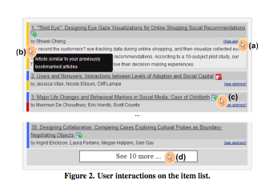
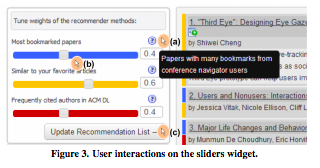
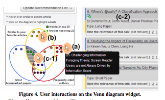

# Comentarios: "See What You Want to See: Visual User-Driven Approach for Hybrid Recommendation."
## Resumen
Al igual que la lectura pasada, este paper no se trataba de un algoritmo de algún sistema recomendador, si no que de una visualización para mejorar la percepción que tiene un usuario frente al recomendador.

Como lo vimos en el paper pasado, hay una extensa evalución que mide que tan satisfecho queda un usuario después de usar un sistema recomendador y este paper se enfoca principalmente en una de las ideas que tiene esa evaluación: el control y transparencia que tiene el usuario sobre la personalización del recomendador.

El documento comienza con una introducción sobre lo presente que están los sistemas recomendadores en nuestra vida y que tradicionalmente siempre se ha intentado mejorarlos en cuanto a su *accuracy*. Pero últimamente se ha intentado ir más allá y se ha investigado sobre la interacción entre el computador y el humano. En estas investigaciones se ha mostrado que las *features* visuales juegan un rol importante en la percepción del usuario en cuanto al sistema recomendador.

De la importancia de este aspecto visual que se mensiona,introducen su idea de hacer una visualización que le permita al usuario elegir la importancia de cada recomendador dentro del sistema híbrido. El sistema recomendador detrás de la visualización iba a recomendar charlas de conferencias con respecto a 3 algoritmos: *Content-based*, *Author-based Popularity* y *Bookmarking Popularity*.

Después de hablar sobre tranbajos que intentaron llevar a cabo la misma idea, explican de manera detallada cada parte de la visualización. Este consiste en tres partes:

1. Lista de charlas recomendadas: Consiste en una lista donde se encuantran las recomendaciones que se encontraron dado al sistema híbrido. Tiene varias interacciones, pero la que más me llamó la atención es el *hover over* que da la explicación de por qué se recomendó.

2. *Sliders widget*: Es una visualización donde se pueden modificar los pesos de cada algoritmo para conformar el sistema recomendador híbirdo. Al igual que la parte anterior, tiene varias *features* como por ejemplo al pasar el mouse sobre un algoritmo, aparecerá un *textbox* explicándolo. 
   

3. *Widget* de diagrama de Venn: En esta parte se ve un diagrama de Venn en donde aparecen las charlas recomendadas dentro de elipses que representan charlas ya vistas.
   

Para terminar, el paper termina mostrando los resultados de la visualización es dos conferencias: CSCW 2013 y UMAP 2013. Los resultados dan información que respalda que la visualización es una recomendación "natural" y que impacta de mejor manera en la motivación, en la actitud y en el rendimiento del usuario.

## Opinión
Al igual que el otro paper, me gustó que fuera distinto al resto de papers que habíamos leído. No se enfoca tanto en el rendimiento computacional de un algoritmo, si no que en intentar dar el mejor servicio posible al cliente.

La verdad es que no me extraña que les haya ido bien con la visualización. Se veía bastante amigable y muy simple de utilizar, y a su vez, demasiado útil. Me gustó mucho la idea del diagrama de Venn, siento que llama mucho la atención y dan más ganas de usar el recomendador para averiguar que charla ver después.

Me gusta que la visualización tuviera muchísimas interacciones, siento que aumenta la concentración y las ganas de usarlo para la siguiente charla.

También me gustó mucho que la visualización le de cierto control al usuario, esto hace que el usuario confié mucho más en la charla recomendada y da la percepción de que está mejor hecho el sistema.

Encontré una *feature* importante que se explique el por qué de la recomendación, al igual que el control, siento que aumenta considerablemente la confianza usuario-recomendadore y por supuesto la satisfacción del cliente.

Para ir cerrando, creo que fue un paper bastante interesante que buscó mejorar un sistema recomendador, no desde un lado algoritmico, si no que la interacción programa-cliente. Al igual que el paper anterior, aprendí que no necesariamente lo más importante en los sistemas recomendadores es optimizar el funcionamiento de un algoritmo, si no que es optimizar la satisfacción del usuario.