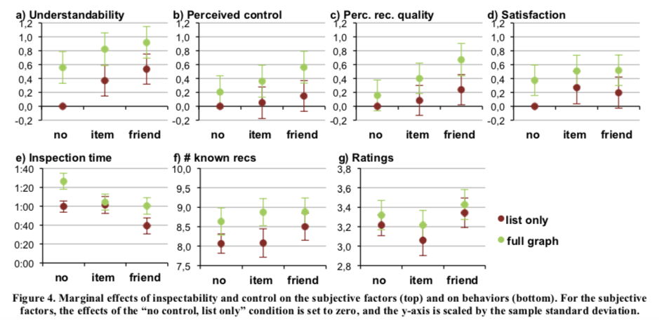
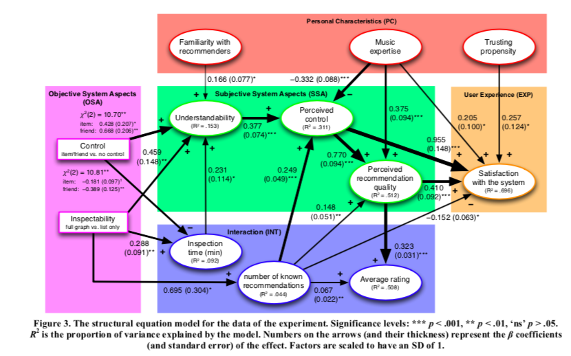

# Comentarios: Inspectability and Control in Social Recommenders
## Resumen
En este paper nos cuentan de un experimento que hicieron con los sistemas recomendadores de música de Facebook con respecto al control y transparencia de los recomendadores sociales. Estos, a diferencia de los algoritmos anteriormente leídos en el curso, están basados en los amigos de Facebook y no en los *nearest neighbors*.

El documento comienza con una introducción donde escriben un poco sobre los recomendadores sociales y la importancia del control y la transparencia de un sistema que recomienda. La transparencia en estos recomendadores son especialmente importantes porque la explicación de una recomendación es en base a amigos tuyos y eso puede traer mucha confianza. También el control es super importante porque es posible que al usuario no le guste todos los *items* por igual o puede valorar las preferencias de amigos de forma distinta a los *likes* que comparten.

Luego hablan de trabajos anteriores que han trabajado con el área y nos contextualizan un poco sobre lo que se ha investigado en la transparencia y control en los sistemas recomendadores. También nos cuentan de papers que se enfocan en la evaluación del usuario y en las características personales de los usuarios que pueden afectar el resultado.

Prosiguen con la explicación del experimento. Nos explican rápidamente el funcionamiento del algoritmo en donde se le pone un peso a cada amigo, calculado así:

$$  W_{friend_{i}} = \frac{TWCI_{user,friend_i}}{\sqrt{TWI^2_{user} * TWI^2_{friend_i}}} $$

donde $TWCI_{x, y}$ es el peso de los "likes" que comparten $x$ e $y$ y $TWI_x$ es el peso total de los *items* con *like* del usuario $x$. Por último a cada recomendación le dan un peso calculado de la siguiente manera:

$$ W_{rec_i} = \sum_{friend_j \: likes \: rec_i} W_{friend_j} $$

donde $W_{x}$ es el peso que le da x al *item*.

Para la transparencia, hicieron un grafo interactivo que muestra a los amigos, los distintos *items*, y las recomendaciones. Al apretar el grafo, te muestra las distintas conecciones entre los nodos. Para el control crearon unos *sliders* con los que se pueden modificar los pesos de los *items* y de los amigos.

Para el experimento dividieron a los participantes según distintos niveles de control y de transparencia. Para la división en transparencia habían dos grupos: los que tenían el grafo y los que tenían una lista de recomendaciones no más. Y para la división de control los dividieron en 3: los que no podían modificar nada, los que podían modificar el peso de los *items* y los que podían modificar los pesos de los amigos.

Los resultados fueron bastante positivos y calzaban con lo que anunciaban en la introducción y trabajos relacionados. Para los usuarios que utilizaron el grafo, observamos que la experiencia de percepción de control y calidad respecto a la utilización del mismo, mejoró; junto con ello, la experiencia del recomendador aumentó significativamente.

La diferencia entre tener control por los pesos de los *items* o de los amigos no es estadísticamente significativa, pero si hay una diferencia con los que no tienen control.

## Opinión
Personalmente encontré que el documento es muy completo. Contiene partes que son matemáticas, otras que le dan lugar al experimento y otra donde se interpretan los resultados.

Las imágenes con respecto al grafo creo que fueron un gran aporte para aterrizar de mejor forma lo que veían los usuarios y lo mismo me pasó con la imagén de los *sliders*. Sin esas imágenes habría sido mucho más difícil entender cómo se veían las visualizaciones.

Destaco mucho los gráficos que pusieron en la parte de discusión. Creo que resumen muy bien los resultados finales del experimento. Son muy intuitivos de entender y se saca información de manera rápida. Además son un gran complemento a lo que uno va leyendo en esa parte del paper.

Eso si, hay una visualización que no la encontré tan certera. Tiene muchas flechas y muchos números que no son fáciles de entender, lo que produce una sensación de desorientación en la imágen. No es tan fácil saber por dónde empezar.

Me gustó mucho que a los resultados le buscaran una justificación. Muchas veces, en los papers simplemente ponen los resultados y hacen una conclusión con respecto a ellos. Pero en este documento, como tenían un poco de información del usuario, intentaban darle una explicación a cada resultado que salía sacando conclusiones un poco más allá del mero resultado.

En conclusión, me gustó mucho el paper. Creo que es bastante completo y transmiten muy bien su mensaje. Dejan un experimento, que a mí parecer, estaba muy bien hecho con resultados bastante concisos: la transparencia y el control del usuario en un sistema recomendador aumenta considerablemente la experiencia de este.